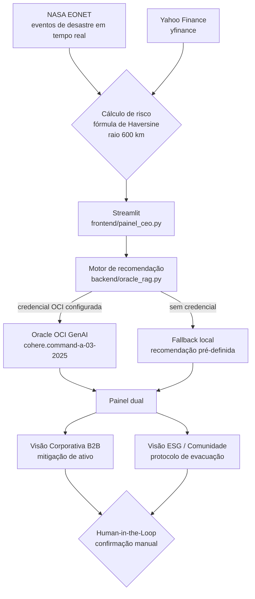
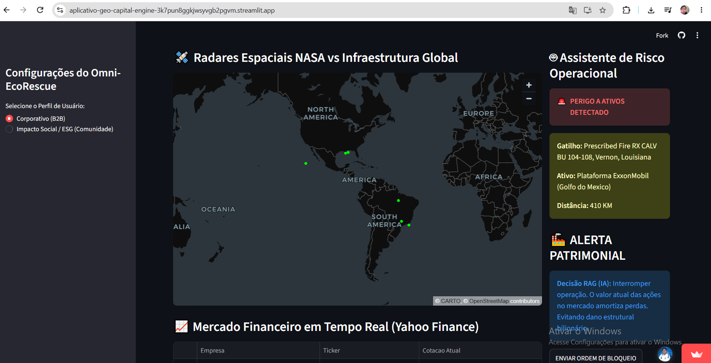
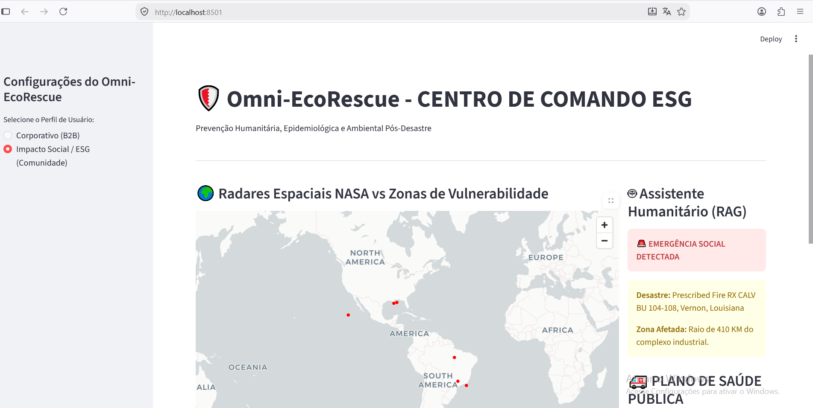

# Omni-EcoRescue
**Acesso ao MVP Público:** [https://aplicativo-geo-capital-engine-3k7pun8ggkjwsyvgb2pgvm.streamlit.app/](https://aplicativo-geo-capital-engine-3k7pun8ggkjwsyvgb2pgvm.streamlit.app/)

Sistema preditivo que cruza dados de desastres da NASA com ativos industriais globais (plataformas offshore, mineração, agronegócio) para prevenir perdas corporativas e proteger comunidades vizinhas em risco.

Projeto desenvolvido para o Hackathon "Tech for Change".

---

## O Problema

Desastres climáticos severos atingem infraestruturas industriais críticas. A falta de precisão na tomada de decisão gera duas consequências:

- **Dano Corporativo**: perda estrutural e desvalorização de ativos.
- **Dano Social**: comunidades vizinhas (pescadores, ribeirinhos) afetadas por riscos secundários (vazamentos, contaminação) sem tempo hábil para evacuação.

## A Solução

Painel dual que apresenta, para o mesmo evento de risco, duas perspectivas:

- **Visão Corporativa (B2B)**: cruza a localização do evento (NASA EONET) com o valor de mercado do ativo (Yahoo Finance) e recomenda ação de mitigação.
- **Visão de Impacto Social (ESG/Comunidade)**: identifica a comunidade vizinha ao ativo e recomenda protocolo de evacuação/suporte humanitário.

Em ambas as visões, o sistema recomenda — a decisão final e o acionamento de qualquer ação são sempre confirmados por um humano, via botão no painel (Human-in-the-Loop).

## Estudo de Caso

Bacia de Campos (RJ) — infraestrutura da Petrobras e Colônia de Pescadores Z3 de Macaé, que já possui vínculo formal com a Petrobras via Plano de Compensação Ambiental exigido pelo IBAMA.

## Arquitetura

| Camada | Tecnologia |
|---|---|
| Frontend | Streamlit (`frontend/painel_ceo.py`) |
| Cálculo de risco geoespacial | `math` (fórmula de Haversine, raio de 600 km) |
| Dados de desastres | NASA EONET (tempo real) |
| Dados de mercado | Yahoo Finance (`yfinance`) |
| Inteligência Artificial | Oracle OCI Generative AI (`cohere.command-a-03-2025`), com fallback local seguro |

### Fluxo do sistema



## Como rodar localmente

```bash
# 1. Instalar dependências
pip install streamlit requests yfinance pandas oci

# 2. Rodar o painel (a partir da pasta raiz do projeto)
streamlit run frontend/painel_ceo.py
```

Rodando localmente, o app abre em http://localhost:8501. Para usar sem instalar nada, acesse a versão publicada na nuvem: https://aplicativo-geo-capital-engine-3k7pun8ggkjwsyvgb2pgvm.streamlit.app/

### Integração com Oracle (opcional)

O motor de recomendação (`backend/oracle_rag.py`) funciona em dois modos:

- **Real**: requer o SDK `oci` instalado e a variável de ambiente `OCI_COMPARTMENT_ID` configurada, além do arquivo de credenciais `~/.oci/config`.
- **Fallback (padrão)**: se a credencial não estiver configurada, o sistema usa uma recomendação local pré-definida, mantendo o painel estável em demonstrações públicas.

## Capturas de tela (versão publicada no Streamlit Cloud)

**Visão Corporativa (B2B)** — cruza o evento de risco (NASA EONET) com o ativo industrial mais próximo e recomenda ação de mitigação.



**Visão de Impacto Social / ESG (Comunidade)** — identifica a comunidade vizinha ao evento e recomenda protocolo de evacuação/suporte humanitário.



## Documentação completa

Ver `docs/documentacao_oficial_pitch.md` para a documentação oficial do projeto, incluindo a base legal (CONAMA/EIA-RIMA) e o modelo de negócio detalhado.

## Status do projeto (MVP de Hackathon)

- [OK] Cálculo de risco geoespacial funcional
- [OK] Integração real com NASA EONET e Yahoo Finance
- [OK] Human-in-the-Loop implementado no painel: a ação (simulada) só ocorre após o clique de confirmação do gestor
- [EM ANDAMENTO] Integração com Oracle GenAI: implementada, sujeita a fallback conforme disponibilidade de credencial
- [EM ANDAMENTO] Scripts em `backend/central_executiva.py` e `backend/omni_engine_alertas.py` são provas de conceito isoladas, não conectadas ao painel principal

## Equipe e Contribuições

- **Leonardo Junior Gonzales Mendoza** (RM 373713) — desenvolvimento do painel em Python/Streamlit, integração com as APIs geoespaciais e financeiras, estruturação da arquitetura de IA (Oracle GenAI) e infraestrutura do repositório.
- **Felipe Eunilio Vieira dos Santos** (RM 369771) — concepção do framework de produtização e modelo de negócio (documento "Decision Intelligence"), incluindo o posicionamento B2B e a lógica de Human-in-the-Loop aplicada à solução.
- **Helton Rosa da Silva Abadia** (RM 360372) — ajustes técnicos no código, incluindo correção de um bug no motor de alertas que bloqueava o disparo de múltiplos alertas; alterações já enviadas ao GitHub e em processo de integração à branch principal.

## Limitações conhecidas

- A IA generativa da Oracle roda em modo de fallback na demonstração pública: sem credencial OCI, o sistema usa uma recomendação local pré-definida.
- O disparo real de alertas (SMS/WhatsApp) ainda não está implementado; os botões do painel exibem a confirmação na tela (simulação), sem envio real.
- O nome "RAG" no painel se refere ao motor de recomendação; a etapa de recuperação de dados (ex.: base do EIA/RIMA) é um próximo passo.
- A base de 6 ativos e comunidades do MVP é ilustrativa e fixa no código; o estudo de caso da Bacia de Campos é um cenário de referência.
- Os scripts `backend/central_executiva.py` e `backend/omni_engine_alertas.py` são provas de conceito isoladas, não conectadas ao painel principal.
- Os dados dependem da disponibilidade das APIs públicas (NASA EONET e Yahoo Finance).
- A validação com usuários ainda é inicial; a validação de campo com comunidades reais é um próximo passo.

## Próximos passos

1. Validação de campo com colônias de pescadores e mentores do setor.
2. Integração ativa com o Oracle GenAI (`cohere.command-a-03-2025`) em produção.
3. Parceria piloto com uma operadora para acessar dados reais de EIA/RIMA.
4. Canal de disparo real (SMS/WhatsApp) para lideranças comunitárias.
