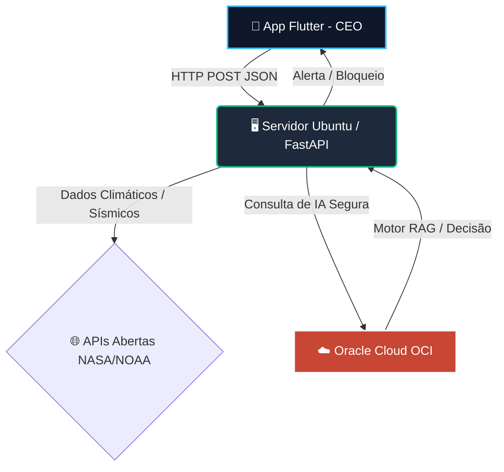

# 🌐 Omni-Capital Engine

## 📖 Sobre o Projeto
O **Omni-Capital Engine** é um painel de comando global (Dashboard) B2B focado na tomada de decisões executivas de alto risco. O sistema cruza dados geoespaciais e climáticos abertos (Open Data: NASA, NOAA, USGS) com dados do mercado financeiro. 

Utilizando Inteligência Artificial e a arquitetura **RAG** (Retrieval-Augmented Generation), o sistema avalia ameaças às operações logísticas (plataformas de petróleo, refinarias, minas) e decide de forma autônoma se uma ordem de evacuação é real ou um Falso Positivo, economizando milhões de dólares em logística desnecessária.

---

## 🏗️ Arquitetura do Sistema

O projeto foi construído utilizando uma arquitetura de microsserviços de alta disponibilidade, separando a interface do usuário do motor de inteligência artificial.

### Tecnologias Utilizadas:
- **Frontend:** Flutter Web (Dart) com injeção de mapas via `flutter_map`. Hospedado no GitHub Pages.
- **Backend:** Python (FastAPI + Uvicorn) rodando como serviço (systemd) em uma VPS Linux Ubuntu.
- **Inteligência Artificial:** Integração projetada para o ecossistema Oracle Cloud Infrastructure (OCI) Generative AI.
- **Segurança:** Configuração de CORS restrita, proteção de chaves de API pelo backend (BFF - Backend For Frontend).

---

## 💰 Viabilidade Financeira (ROI)
- **O Custo do Problema:** Uma evacuação de emergência falsa (Falso Positivo) em uma plataforma *offshore* custa, em média, de **R$ 3M a R$ 5M por dia**.
- **Investimento (CAPEX):** Estimado em R$ 500.000,00 (Dev Team, Integração Oracle Cloud, Infraestrutura Edge).
- **Payback (Tempo de Retorno):** Imediato. A prevenção de um único Falso Positivo cobre 10x o valor investido no software.
- **Projeção de 5 Anos:** Economia estimada de **R$ 75 milhões** ao evitar apenas 3 paralisações desnecessárias por ano em uma frota global.

---

## 🔮 Evolução do Produto (Roadmap)
1. **Integração Edge Computing & IoT:** Cruzamento de dados em nuvem com sensores de telemetria locais operando offline, garantindo a tomada de decisão mesmo se a operação perder a conexão com a internet.
2. **Auditoria em Firestore:** Registro imutável (logs) de todas as decisões e recusas tomadas pela IA para fins de compliance corporativo e relatórios de diretoria.
3. **SSO Corporativo:** Ativação real do módulo de autenticação integrado com o Google Workspace corporativo.

---

## 🚀 Como rodar o projeto localmente

**1. Clone o repositório:**
`git clone https://github.com/LeonardoGMendoza/aplicativo-geo-capital-engine.git`

**2. Acesse a pasta do projeto:**
`cd aplicativo-geo-capital-engine`

**3. Instale as dependências do Flutter:**
`flutter pub get`

**4. Rode no emulador ou navegador local:**
`flutter run -d chrome`
